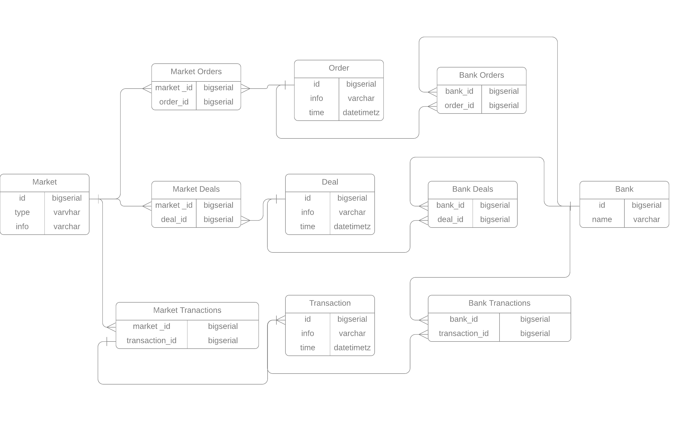

# HighloadArchitectureCourseWork

## 1. Выбор темы
Аналог современной торговой биржи, например [Московская биржа](https://www.moex.com/) или [Nasdaq](https://www.nasdaq.com/)

##  2.  Определение возможного диапазона нагрузок

Рассмотрим особенности расчета нагрузки на биржу. Основная нагрузка идет на бирже на торгово-клиринговую систему (ТКС), через которую проходят транзакции, заявки и сделки.
 
Можно сделать вывод, что если мы рассмотрим нагрузки на ТКС валютного, фондового и срочного рынка, то тем самым рассмотрим основную нагрузку на биржу. 

В качестве аналога, относительно которого будем рассматривать нагрузку - Московская Биржа. Особенность биржи в том, что часть данных о нагрузке и отказоустойчивости есть в открытом доступе, так как это важно для привлечения клиентов. 

Для определения возможного диапазона нагрузок и дальнейших расчетов воспользуемся следующими материалами:
- [Результаты нагрузочного тестирования московской биржи в от 30 марта 2019 года](https://www.moex.com/n23621/?nt=0)

### Нагрузка на ТКС фондового рынка


	

Участвовало 14 банков

### Нагрузка на ТКС валютного рынка


Участвовало 18 банков

### Нагрузка на ТКС срочного рынка


Участвовало 15 банков

### Следовательно суммарная нагрузка на биржу

В день:

|Транзакции|Заявки|Сделки|
|----------|------|------|
|522 058 763|269 974 995|9 368 033|

В секунду:

|Транзакции|Заявки|Сделки|
|----------|------|------|
|299 720|66 355|4 474|

##### Примечание: 

 В отчете о нагрузочном тестировании оговаривается то, что реальная нагрузка в боевых условиях ниже, чем та, что была представлена в нагрузочном тестировании

## 3. Выбор планируемой нагрузки

Будем считать, что нагрузка на биржу от каждого банка одинакова. 

В среднем при оценке нагрузки участвовало 16 банков. Следовательно с одного банка приходилась нагрузка:

В день:

|Транзакции|Заявки|Сделки|
|----------|------|------|
|32 628 672,69|16 873 437,19|585 502,06|

В секунду:

|Транзакции|Заявки|Сделки|
|----------|------|------|
|18 732,5|4 147,19|279,625|

Исходя из тех же результатов нагрузочного тестирования, по итогам рекомендуется использовать для обычного протокола канал в 10 Мбит/с 

Зная нагрузку в секунду посчитаем приблизительный размер пакета:

```
(10 x 1024 x 1024) / (18 732,5 + 4 147,19 + 279,625) ~ 450 бит
```

Мы будем обслуживать 1000 банков

Тогда нагрузка будет: 

В день:

|Транзакции|Заявки|Сделки|
|----------|------|------|
|32 628 762 700|16 873 437 200|585 502 060|

В секунду:

|Транзакции|Заявки|Сделки|
|----------|------|------|
|18 732 500|4 147 200|279 640| 

Тогда нагрузка в секунду будет: 

```
(18 732 500 + 4 147 200 + 279 640) x 450 = 10 421 703 000 бит/с = 9,7 Гб/с
```
 Нагрузка в день будет: 
 
 ```
 (32 628 762 700 + 16 873 437 200 + 585 502 060) * 450 бит = 22 539 465 882 000 бит = 2,6 Тб
 ```
 
## 4. Логическая схема Базы Данных


## 5. 