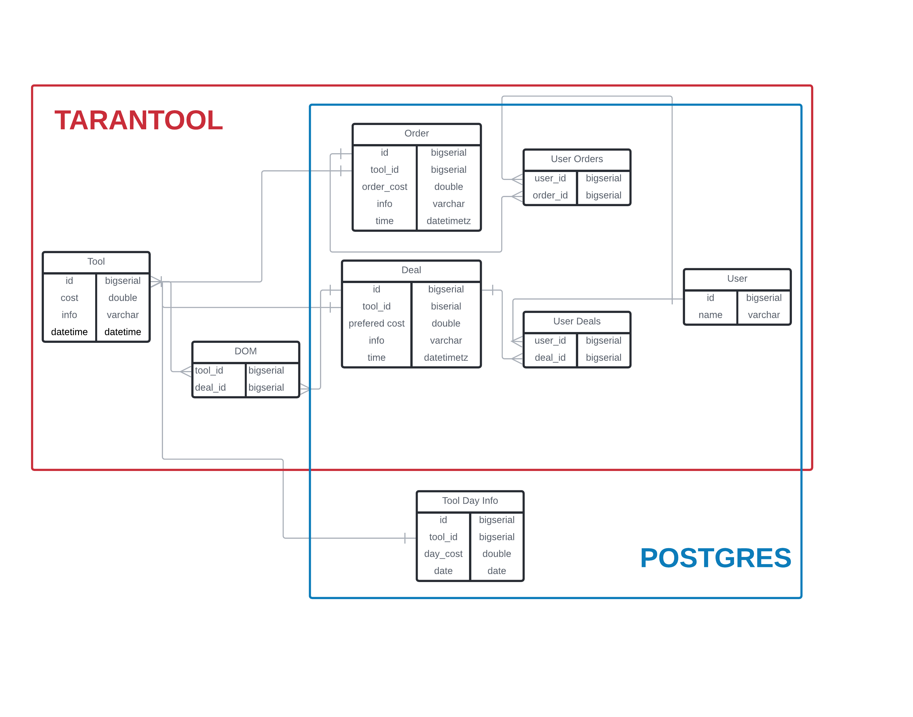

# HighloadArchitectureCourseWork

## 1. Выбор темы
Аналог современной торговой биржи, например [Московская биржа](https://www.moex.com/) или [Nasdaq](https://www.nasdaq.com/)

##  2.  Определение возможного диапазона нагрузок

Рассмотрим особенности расчета нагрузки на биржу. Основная нагрузка идет на бирже на торгово-клиринговую систему (ТКС), через которую проходят транзакции, заявки и сделки.
 
Можно сделать вывод, что если мы рассмотрим нагрузки на ТКС валютного, фондового и срочного рынка, то тем самым рассмотрим основную нагрузку на биржу. 

В качестве аналога, относительно которого будем рассматривать нагрузку - Московская Биржа. Особенность биржи в том, что часть данных о нагрузке и отказоустойчивости есть в открытом доступе, так как это важно для привлечения клиентов. 

Для определения возможного диапазона нагрузок и дальнейших расчетов воспользуемся следующими материалами:
- [Результаты нагрузочного тестирования московской биржи в от 30 марта 2019 года](https://www.moex.com/n23621/?nt=0)

### Нагрузка на ТКС фондового рынка


	

Участвовало 14 банков

### Нагрузка на ТКС валютного рынка


Участвовало 18 банков

### Нагрузка на ТКС срочного рынка


Участвовало 15 банков

### Следовательно суммарная нагрузка на биржу за 2.5 часа (9000 секунд) нагрузочного тестирования

|Транзакции|Заявки|Сделки|
|----------|------|------|
|522 058 763|269 974 995|9 368 033|

### Нагрузка в секунду в среднем:
|Транзакции|Заявки|Сделки|
|----------|------|------|
|58 007|29 998|1041|

### Максимальная нагрузка в секунду:

|Транзакции|Заявки|Сделки|
|----------|------|------|
|299 720|66 355|4 474|

##### Примечание: 

 В отчете о нагрузочном тестировании оговаривается то, что реальная нагрузка в боевых условиях ниже, чем та, что была представлена в нагрузочном тестировании

## 3. Выбор планируемой нагрузки
Будем считать, что нагрузка на биржу будет аналогична результатам максимальной нагрузки из нагрузочного тестирования. Следовательно наша нагрузка в секунду будет:

|Транзакции|Заявки|Сделки|
|----------|------|------|
|299 720|66 355|4 474| 


Исходя из тех же результатов нагрузочного тестирования, по итогам рекомендуется использовать для обычного протокола канал в 10 Мбит/с 

Зная нагрузку в секунду посчитаем приблизительный размер пакета:

```
(10 x 1024 x 1024) / (299 720 + 66 355 + 4 474) ~ 29 бит
```

Наш сервис будет обеспечивать [100 крупнейших банков Европы](https://www.invest-rating.ru/financial-forecasts/?id=7903)
Расчет ведем от того, что эти 100 банков создают схожую нагрузку  на наш сервис, как и в нагрузочном тестировании. Рассчитаем нагрузку в секунду.  


```
(299 720 + 66 355 + 4 474) x 29 бит = 10 745 921 бит/с = 10,75 Мбит/с
```

Исходя из [данных](https://www.moex.com/s223) максимальное время торгов 14 часов 20 минут (860 минут), тогда нагрузка в день со всех клиентов считается по формуле: 

```
(Нагрузка в секунду) * 860 * 60

 10,75 Мбит/с * 860 * 60 = 554 700 Мбит = 554,7 Гбит = 69,3 Гбайт 
 ```
 
## 4. Логическая схема Базы Данных


## 5. Физические системы хранения
Выделим основные особенности нагрузки на СУБД Биржи: 
- Часто пишем
- Часто читаем
- Данные нельзя потерять
- Задержка должна быть минимальной
- Аналитические запросы к большому объему данных прошедших торгов
- Аналитические запросы для построения стакана и изменения стоимости для текущих торгов

Так как мы часто пишем и читаем - нам подойдет обычная SQL СУБД. Возьмем Postgres 12, так как она хорошо поддерживается сообществом, имеет хороший встроенный механизм репликации, а также хорошие инструменты шардинга (например Postgres XL). 

Также во время торгов нам нужно обеспечить минимальную задержку. Для этого мы будем использовать in-memory хранилище tarantool, в котором будем хранить **данные текущих торгов и данные необходимые для текущей торговли**, так как это одни из самых "горячих" данных данного сервиса.

Чтобы обеспечить возможность аналитические запросов для построения стакана и изменения стоимости для текущих торгов - будем дублировать эти данные из таблиц Postgres в специальные таблицы Tarantool, для того, чтобы не делать аналитические запросы в Postgres. 

Благодаря этому, мы получаем избыточные данные, но при этом большой прирост в скорости. Вывод - данное решение имеет смысл, так как решает нашу задачу минимальными усилиями. 

**Схематичное разделение между базами данных:**

 


**Синий -** Postgres

**Красный -**  Tarantool


### Шардинг
Так как объем данных довольно большой - нужно подумать о том, как мы будем шардить наши данные между серверами СУБД. 

#### Tarantool
Шардинг будем производить с помощью хеш-функции от инструмента, количества операций с ним и количества серверов, что позволит нам распределить наши данные равномерно по серверам и не переполнить шарды. При этом крупные инструменты будут храниться на отдельных шардах (например акции Лукойл), а акции к которым мало запросов - вместе с другими такими же акциями. Информацию о стакане будем хранить на том же шарде, что и инструмент, что позволит формировать аналитический ответ быстро. 

#### Postgres
Postgres играет роль долговременного хранилища. В Postgres мы храним все пользовательские операции, историю торговли инструментом, его конечную цену и прочее. На основе торгов в Tarantool мы формируем данные для Postgers и вставляем их после торгового дня. 

Здесь шардинг будет с помощью хеш-функции от пользователя, количества его операций и количества серверов. Также, так как данные о торгах по итогу дня малы, то мы можем выделить для этого отдельный шард. 

### Нагрузка 
Ото всех клиентов нагрузка будет (из таблицы транзакции, сделки и заказы в секунду) будет нагрузка: 

```
299 720 + 66 355 + 4 474 = 370 550 RPS
```

###  Репликация
Для Tarantool, изучив [документацию по реплицкации](https://www.tarantool.io/ru/doc/latest/book/replication/repl_architecture/) будем использовать репликацию **master - master** так как мы много читаем и пишем в базу.

Для Postgres будем использовать репликацию **master-slave**, так как из данной базы мы будем больше читать, чем писать. Следовательно пишем на мастер сервер, а читаем со слейв серверов. 

## 6. Выбор прочих технологий: языки программирования, фреймворки, протоколы взаимодействия, веб-сервера и т.д.

### Frontend
В нашем случаем клиентом будет пользовательский браузер. Так как браузер исполняет только JavaScript код, то наш клиент будет использовать нативную для браузера технологию в связке с HTML и CSS для отображения данных пользователю. 

Также для того, чтобы фронтенд скачивался один раз, а после только получал данные для отрисовки от сервера Ajax запросами мы будем использовать концепцию SPA (Single Page Application), которая позволит нам скачивать фронтенд лишь при первом запросе к нашей странице. 

**Технологии**
- Javascript
- HTML
- CSS
- SPA

### Backend
Наш бэкенд будет иметь микросервисную архитектуру. Это позволит нам без особых усилий масштабировать конкретный сервис, а не всю систему. Также если упадет один из сервисов - не упадает вся система. Главной причиной почему нам необходимо использовать микросервисную архитектуру - это возможность разработки сервисов на разных языках. 

Для разработки сервисов мы будем использовать язык Golang, так он специально разрабатывался как язык для написания серверов. Имеет встроенный механизм горутин, позволяющий нам просто и эффективно писать код. Также встроенный кодстайл "из коробки", который нам будет полезен в командной разработке. 

**Технологии**
- Golang
- Микросервисная архитектура

### Протоколы общения
Для общения между клиентом и сервером выберем протокол HTTP2, который обеспечит нам быстрое общение с сервером благодаря двунаправленности установленного соединения, а также благодаря тому, что протокол бинарен. 

Также с целью ускорения общения между клиентом и сервером будем использовать protobuf, так его размер меньше аналогичных форматов (json, xml), а скорость парсинга выше из-за заранее скомпилированный структур данных. Protobuf поддерживает много языков, в том числе C++, Golang и Javascript. Также несомненным плюсом protobuf является генерация документации на основе структур, что позволит проще обеспечивать качество в разработке нашего продута. 

Для общения между микросервисами будем использовать gRPC - протокол над HTTP2, который позволяет удаленно вызывать функции на других серверах. Так же он для общения использует по умолчанию Protobuf, что является несомненным плюсом к скорости общения между сервисами. 

**Технологии**
- HTTP2
- Protobuf
- gRPC


### Балансировка нагрузки и отдача статики

Для балансировки нагрузки и отдачи статики будем использовать Nginx, так как он зарекомендовал себя на больших нагрузках в современных высоконагруженных сервисах. Он поддерживается сообществом и имеет открытый исходный код, что позволяет нам собрать его под наши нужды, под него можно писать свои модули, а также использовать модули других разработчиков. Все это добавляет гибкости к производительному инструменту, что является несомненным плюсом для нас, как для разработчиков. 

**Технологии**
- Nginx

## 7. Расчет нагрузки и потребного оборудования

### Фронтенд + балансировочные сервера

Нагрузка на фронтенд сервера будет сравнительно небольшой, так как мы обслуживаем 100 банков, то нагрузка на такие сервера будет минимальна, поэтому сервера с фронтендом можно объединить с балансировочными серверами, так как на обоих серверах за работу будет отвечать nginx.

Исходя из [документации nginx](https://www.nginx.com/blog/testing-the-performance-of-nginx-and-nginx-plus-web-servers/) можно сделать вывод, что для балансировки ~ 400 000 RPS (сумма запросов от сделок + запросы на получение фронтенд (сборка фронтенда с учетом минификации и сжатия не превышает 2 Мбайта)) по HTTPS и учетом того, что Nginx на ядро может принять ~ 10 000 RPS нам потребуется 12 серверов данной конфигурации:

|CPUs|Memory|SSD|
|-|-|-|
|36|32 Gbs|128 Gbs|

Сделаем 25% запас мощности и возьмем 15 серверов данной конфигурации.

### Бэкенд сервера

На наш бэкенд однозначно будет нагрузка на сервис с транзакциями 370 550 RPS + приблизительно столько же остальных запросов на другие сервисы (аналитические запросы и тд). 

Так как запросы в основном подразумевают запросы от бэкенда к базам данных, то будем считать, что на бэкенд сервера приходится приблизительно такая же нагрузка, как и на базы данных - 5000 RPS. Тогда на 741 100 RPS нам понадобится 

```
741 100 RPS / 5000 RPS = 149 серверов
```

Возьмем сервера с 25% запасом 187 серверов. Для данных серверов важен процессор и объем оперативной памяти. Тогда возьмем сервера следующей конфигурации:

|CPUs|Memory|SSD|
|-|-|-|
|32|32 Gbs|64 Gbs| 

### Сервера для баз данных 
#### Tarantool
На сервере tarantool мы храним только данные торгов текущего дня. Следовательно получаем, что в день у нас 

```
370 550 RPS x 860 x 60 (время торгов) ~ 19 120 380 000 запросов в день 
```

Вес одного запроса, как мы считали ранее, 29 бит = 0,003625 Кбайт. Воспользуемся [калькулятором](https://www.tarantool.io/ru/sizing_calculator/) Tarantool для расчетов c учетом репликации.

  

В данной конфигурации RAM и SSD уже взяты с > 25% запасом. Возьмем CPU с запасом, тогда нам понадобится 16 серверов. С учётом 2х реплик.

```
16 * 3 = 48 серверов
``` 

Возьмем сервера данной конфигурации: 

|CPUs|Memory|SSD|
|-|-|-|
|16|16 Gbs|128 Gbs|

При этом оперативная память и ssd взять с 2х кратным запасом для обеспечения пропускной способности оборудования при высоких нагрузках и для более долгого срока службы серверов. 

#### Postgres

В день на наш сервис приходит 69,3 Гбайт данных. Добавим в SLA соглашение о том, что подробные данные о торгах будут храниться 10 лет. Тогда для хранения нам понадобиться: 

```
69,3 Гбайт x 366 дней (берем с запасом по дням) x 10 = 253 638 Гбайт данных
``` 

Тогда для обеспечения хранения данных на серверах с 4096 Gbs SSD  нам потребуется  ~ 62 серверов с запасом. 

Ото всех клиентов нагрузка из **п.5** 370 550 RPS. Пусть в среднем на один сервер будет приходиться в среднем 5000 RPS, тогда нам понадобиться: 

```
370 550 RPS / 5000 RPS = 75 серверов
```

Возьмем по большему количеству. 75 серверов. С учетом 25% запаса 94 сервера. 

На каждый master сервер будет приходиться 2 slave сервера. Тогда всего 
```
94 * 3 = 282 сервера
```

Конфигурация сервера:

|CPUs|Memory|SSD|
|-|-|-|
|8|16 Gbs|4096 Gbs|

### Итоговая таблица
|Сервер|Количество|CPUs|Memory|SSD|
|-|-|-|-|-|
|Фронтенд + балансировка|3|4|16 Gbs|128 Gbs|
|Бэкенд|187|32|32 Gbs|64 Gbs| 
|Tarantool|16|16|16 Gbs|128 Gbs|
|Postgres|282|8|16 Gbs|4096 Gbs|

## 8. Выбор хостинга / облачного провайдера и расположения серверов

Для нашего сервиса воспользуемся облачным сервисом Amazon Web Services,  так как он имеет сервера по всему миру - преимущественно в Америке и Европе, что как раз нам и нужно. 

[Схема инфраструктуры Amazon](https://aws.amazon.com/ru/about-aws/global-infrastructure/)

Так как нас интересует минимальное время ответа - то постараемся покрыть серверами Европейский регион, где находятся наши клиенты. Следовательно нужно покрыть Западную, Центральную и Восточную Европу. 

Особенность биржи заключается в том, что датацентры должны находиться рядом для быстрого формирования ответов и быстрого обновления. Для обеспечения всей Европы с помощью одного датацентра возьмем сервера во **Франкфурте** в каждой из трех серверных зон. Данное место обеспечено тем, что эти датацентры равноудалены в среднем от каждой их точек Западной, Центральной и Восточной Европы. 

В каждом регионе сервера будем брать из разных зон доступности, чтобы обеспечить отказоустойчивость в случае падения одного из дата-центров.

Также мы сразу "из коробки" получаем [защиту от DDoS аттак](https://aws.amazon.com/ru/shield/?whats-new-cards.sort-by=item.additionalFields.postDateTime&whats-new-cards.sort-order=desc) и [Kubernetes](https://aws.amazon.com/ru/kubernetes/) для оркестрации наших микросервисов на бэкенде

### Итоговая таблица по распределению серверов
|Сервер|Количество|Датацентр|Количество в зоне 1|Количество в зоне 2|Количество в зоне 3|
|-|-|-|-|-|-|
|Фронтенд + балансировка|15|Франкфурт|5|5|5|
|Бэкенд|187|Франкфурт|62|62|63|
|Tarantool|48|Франкфурт|16 (master 1)|16 (master 2)|16 (master 3)|
|Postgres|282|Франкфурт|94 (master)|94 (slave 1)|94 (slave 2)|

## 9. Схема балансировки нагрузки
Балансировку нагрузки буде производить на уровне L7 с помощью алгоритма "Взвешенный Round Robin" это позволит сделать равномерную нагрузку на все сервера с учётом их производительности. 

Серверов-балансировщиков будет несколько, чтобы обеспечить необходимую нагрузку и отказоустойчивость.

Для балансировки нагрузки на сущности Nginx-а будем использовать схему балансировки технологию Virtual Server via IP Tunneling на L4. Благодаря этому мы сможем отправлять ответ сервера напрямую клиенту, минуя VIP, как показано на схеме:

  

Также с помощью Nginx будем производить терминами SSL трафика. При отправлении запроса на узел - запрос уже не будет защищен. Защищенное соединение устанавливаем с серверами-балансировщиками, а остальные сервера закрыты от внешней сети. 

## 10. Обеспечение отказоустойчивости

У нас есть несколько точек отказа, которые мы должны рассмотреть: 
- Балансировщик
- Бэкенд
- База данных
- Провайдер


**Балансировщик**

Поставим несколько серверов-балансировщиков с одним общим виртуальным ip - что позволит в случае отказа одно из балансировщиков продолжить получать запросы и отвечать на них. 

**Backend** 

Отказоустойчивость здесь обеспечивает распределение сервисов на разные сервера - здесь нет единой точки отказа, следовательно  весь наш сервис не может упасть единовременно. В случае падения одного из сервисов продолжит функционировать с ограниченной функциональностью (в худшем случае), пока восстанавливается упавший сервис. 

**База данных**

Отказоустойчивость базы данных обеспечивается архитектурой master-slave с реплицированными данными. Это гарантирует, что в случае выхода из строя одного серверов второй продолжит его работу пока тот восстанавливается. 

**Провайдер**

Отказоустойчивость у провайдера обеспечим тем, что возьмем в каждом регионе сервера из разных зон доступности. Это обеспечит функционирование нашего сервиса в регионе в случае даже если откажут один и более дата-центров одновременно. 

**Также необходимо сделать дополнительные меры для обеспечение отказоустойчивость, такие как**: 
- Документирование любых сложных процессов, что не допустить потерю данных или отключение сервиса
- Наличие метрик серверов, чтобы понимать нагрузку на сервис
- Сделать на некоторые сервера двойную нагрузку, чтобы понимать запас мощности серверов и в случае резкого роста нагрузки отключить двойную загруженность с целью дать больше ресурсов для работы и оттянуть время падения сервиса
- Составить SLA с провайдером сети, чтобы предусмотреть все внештатные ситуации
- Качественное логгирование для того, чтобы быстрее понять что происходит с сервисом 
- Автоматизация восстановления серверов
- Проведение нагрузочного тестирования перед развёрткой нового релиза для первичной оценки надежности нового кода
- Автоматизировать метрики поведения сервиса (например процент 500 не должен быть больше 5 процентов), чтобы в моменты превышения данной нормы уведомлялись соответсвующие люди
- Отработка внештатных ситуаций в команде